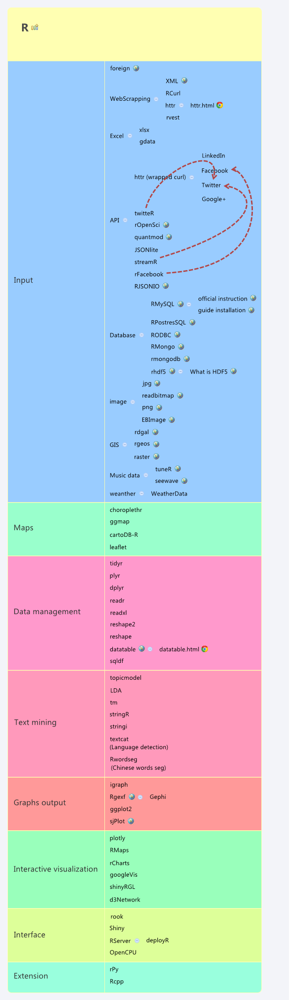

title: DS-Toolbox
date: 2015-04-13 22:25:54
---
This page will updated with interesting tools for data scientist. The tool varies from data management, data cleaning, command line tool, some solution when tackling large dataset (not that big data), data visualisation, Data Science learning resource, etc..

## Learning Resource

Reference:

- [The Open Source Data Science Masters](http://datasciencemasters.org)
- [R oriented Data Science Masters](https://github.com/datasciencemasters/go/blob/master/r-resources.md)

### Statistics & Machine Learning

- [Statistical Learning Stanford / OpenEdX Course](https://class.stanford.edu/courses/HumanitiesScience/StatLearning/Winter2014/about): reading...
- Mining Massive Data Sets / Stanford [Coursera](https://www.coursera.org/course/mmds) & [Digital](http://bit.ly/ebook-miningmassivedata): waiting for next coursera course...
- Machine Learning Andrew Ng [Coursera](http://bit.ly/stanford-ml): done...

### Programming

- [Python Scientific Lecture Notes](http://scipy-lectures.github.io): reading...

## Data cleaning

- [Open Refine](http://openrefine.org/): providing data cleaning solution / open source
- [Data cleaner](http://datacleaner.org/get_datacleaner_ce): data cleaning and assessment / open source & commercial
- [Trifacta Wrangler](https://www.trifacta.com/products/wrangler/): free and commercial edition exists, nice interface but lack of an export of standard script.

## Webscrapping

- R libraries:
    + rvest
    + XML
- Python packages:
    + urllib2 + beautifulsoup
    + [scrapy](http://scrapy.org/)

## Parallel computing

- [Spark](https://spark.apache.org/): fast and general engine for large-scale data processing / open source

## Probabilist Programming

- [Pyro](http://pyro.ai): backend on pytorch
- [PyMC3](https://github.com/pymc-devs/pymc3): backend on theano
- [Edward](http://edwardlib.org/): backend on tensorflow

## Memory bottleneck

- SQLite: write local installation-free SQL DB

## Data visualization

- Map
    - timeline with map: [Timeline.js + StoryMap.js + TimeMapper + TimelineSetter](http://schoolofdata.org/handbook/courses/timeline-tools/)
    - working with map animation & more: [OpenLayer](http://openlayers.org/en/v3.3.0/examples/)
    - image + map + personalized shiny: [ImageMapster](http://www.outsharked.com/imagemapster)
    - beautiful shape file and tiff: [natural earth data](http://www.naturalearthdata.com/)
    - Nasa Source: [http://neo.sci.gsfc.nasa.gov/](http://neo.sci.gsfc.nasa.gov/)
- Datawrapper: [link](http://datawrapper.de), to create personal server and share your creation
- 3rd party visualization solution `$`
    + [Spotfire](spotfire.tibco.com)
    + [Tableau](www.tableau.com)

## Design resources

- Icon set: [flaticon](http://www.flaticon.com/)

## R

My Collection of R packages

